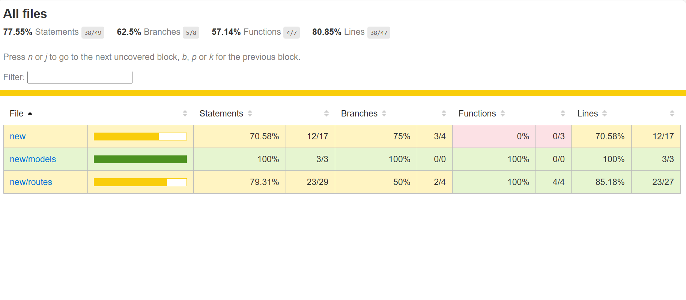

# 📝 Task Manager API

A simple full-stack Task Manager built using **Node.js**, **Express**, **MongoDB**, and **HTML + JavaScript frontend**. It lets you create, view, update, and delete tasks through REST APIs and an interactive UI.  
Now includes **fully tested APIs** using Jest, Supertest, and in-memory MongoDB for automated testing.

---

## 🚀 Features

- ✅ Create a new task
- 📋 View all tasks
- 🟢 Update tasks (e.g., mark as done)
- ❌ Delete a task
- 🌐 Interactive HTML + JS frontend
- 🧪 Full API test coverage with Jest + Supertest

---

## 🧰 Tech Stack

- **Backend**: Node.js, Express
- **Database**: MongoDB with Mongoose
- **Frontend**: HTML + Vanilla JavaScript
- **Testing**: Jest, Supertest, mongodb-memory-server
- **Environment Config**: dotenv

---

## 🛠️ Setup Instructions

### 1. Clone the repository

```bash
git clone https://github.com/psuryasnata/task-manager-api.git
cd task-manager-api
```

### 2. Install dependencies

```bash

npm install

```

### 3. Add environment variables

Create a .env file in the root directory and add:

```bash

MONGO_URI=mongodb://localhost:27017/taskmanager

```
Make sure MongoDB is installed and running locally, or replace with your MongoDB Atlas URI.

### 4. Start the Server

```bash
node index.js
```

The server will start at:
http://localhost:3000

Frontend is available at:
http://localhost:3000/public

###5. Run Test

```bash
npm test
```

To check code coverage:
```bash
npm run test:coverage
```
Coverage report will be generated inside the /coverage folder. Open:
```bash
coverage/lcov-report/index.html
```

## 📷 Test Coverage Screenshot




## 📦 API Endpoints

| Method | Endpoint         | Description     |
|--------|------------------|-----------------|
| POST   | `/api/tasks`     | Create a task   |
| GET    | `/api/tasks`     | Get all tasks   |
| PUT    | `/api/tasks/:id` | Update a task   |
| DELETE | `/api/tasks/:id` | Delete a task   |


## 👨‍💻 Author

**Suryasnata Paital**  
[GitHub Profile](https://github.com/psuryasnata)

---

## 📄 License

This project is licensed under the [MIT License](LICENSE).

